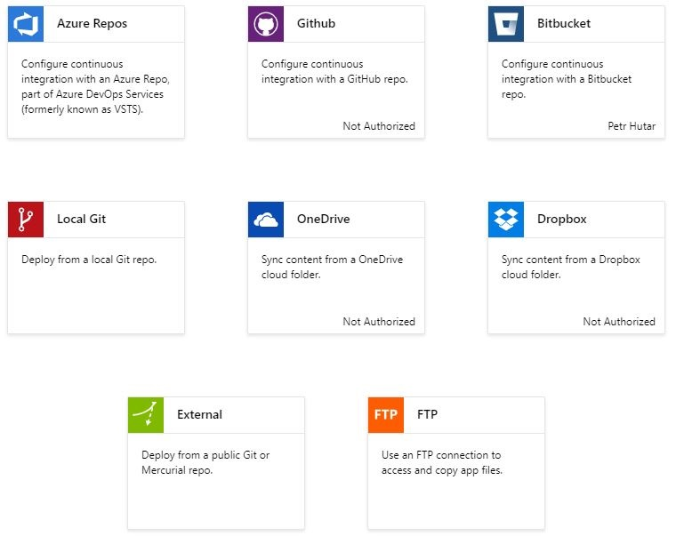

# Deploying MkDocs to Azure Web Apps

This is a short guide on deploying [MkDocs](https://www.mkdocs.org) to Azure. MkDocs is our static site generator of choice, to manage documentation, guides etc. We host the generated sites on Azure as Web Apps.

You can use this guide to get the hang of automated deployment, and then roll your own deployment with your solution and tooling.

## Step 1 - Setup your site repo

Make sure you properly setup a Git repository containing your site. This repository can be used as a stub.

* Deployment is triggered by a commit to a branch of choice on your repo. We strongly recommend to use a good workflow on your repos not to deploy stuff which shouldn't be published yet. A good idea is to setup a [GitFlow Workflow](https://www.atlassian.com/git/tutorials/comparing-workflows/gitflow-workflow) and consider the **master** branch as a deployment branch only. Don't forget to setup approvers to make sure the right content is published.

## Step 2 - Setup the Azure Web App

Setup your Azure Web App, as you would do with any other App. Choose the right subscription and name and deploy.

* Once web app is created, don't forget to set authentication, and access rights appropriate for the intended use

Your site is now up and running, and ready for integration.

## Step 3 - Setup Deployments

At this point, we need to hook up the Git repository with your Azure site. While still on the Azure Portal, configure deployments.

* Open the Web App blade
* Navigate to **Deployment Center**
* Walk through the Deployment Wizard

Here are the supported source code repositories as of this writing. Please notice that all major players are already nicely covered



* Once done, your **Deployment Center** shows a list of each deployment and a first entry is available.

## Step 4 - Write Kudu Deployment Scripts

The deployment scripts have to be added to your repo. They consist of 2 parts:

* **.deployment** file: this file triggers the deployment and points to a deployment script.
* **deploy.cmd** file: the [Kudu](https://github.com/projectkudu/kudu) deployment script itself. Name it any way you want

### .deployment file

Your deployment file is typically extremely simple, and only points to your deployment script. The content below takes care of many scenarios:

```bash
[config]
command = deploy.cmd
```

### deploy.cmd file

This is the actual script which does the heavy lifting. Typically, you would use a [Kudu](https://github.com/projectkudu/kudu) generator to build a stub, then modify to your requirements. For our specific task - deploy, build and update an MkDocs file, simply copy the content below and check if it meets all your requirements.

```bash
@if "%SCM_TRACE_LEVEL%" NEQ "4" @echo off

:: ---------------------------------
:: KUDU Deployment Script for mkdocs
:: Version: 1.0.0
:: ---------------------------------

:: Prerequisites
:: -------------

:: Verify node.js installed
where node 2>nul >nul
IF %ERRORLEVEL% NEQ 0 (
  echo Missing node.js executable, please install node.js, if already installed make sure it can be reached from current environment.
  goto error
)

:: Setup
:: -----

setlocal enabledelayedexpansion

SET ARTIFACTS=%~dp0%..\artifacts

IF NOT DEFINED DEPLOYMENT_SOURCE (
  SET DEPLOYMENT_SOURCE=%~dp0%.
)

IF NOT DEFINED DEPLOYMENT_TARGET (
  SET DEPLOYMENT_TARGET=%ARTIFACTS%\wwwroot
)

IF NOT DEFINED NEXT_MANIFEST_PATH (
  SET NEXT_MANIFEST_PATH=%ARTIFACTS%\manifest

  IF NOT DEFINED PREVIOUS_MANIFEST_PATH (
    SET PREVIOUS_MANIFEST_PATH=%ARTIFACTS%\manifest
  )
)

IF NOT DEFINED KUDU_SYNC_CMD (
  :: Install kudu sync
  echo Installing Kudu Sync
  call npm install kudusync -g --silent
  IF !ERRORLEVEL! NEQ 0 goto error

  :: Locally just running "kuduSync" would also work
  SET KUDU_SYNC_CMD=%appdata%\npm\kuduSync.cmd
)
goto Deployment

:: Utility Functions
:: -----------------

:SelectPythonVersion

IF DEFINED KUDU_SELECT_PYTHON_VERSION_CMD (
  call %KUDU_SELECT_PYTHON_VERSION_CMD% "%DEPLOYMENT_SOURCE%" "%DEPLOYMENT_TARGET%" "%DEPLOYMENT_TEMP%"
  IF !ERRORLEVEL! NEQ 0 goto error

  SET /P PYTHON_RUNTIME=<"%DEPLOYMENT_TEMP%\__PYTHON_RUNTIME.tmp"
  IF !ERRORLEVEL! NEQ 0 goto error

  SET /P PYTHON_VER=<"%DEPLOYMENT_TEMP%\__PYTHON_VER.tmp"
  IF !ERRORLEVEL! NEQ 0 goto error

  SET /P PYTHON_EXE=<"%DEPLOYMENT_TEMP%\__PYTHON_EXE.tmp"
  IF !ERRORLEVEL! NEQ 0 goto error

  SET /P PYTHON_ENV_MODULE=<"%DEPLOYMENT_TEMP%\__PYTHON_ENV_MODULE.tmp"
  IF !ERRORLEVEL! NEQ 0 goto error
) ELSE (
  SET PYTHON_RUNTIME=python-2.7
  SET PYTHON_VER=2.7
  SET PYTHON_EXE=%SYSTEMDRIVE%\python27\python.exe
  SET PYTHON_ENV_MODULE=virtualenv
)

goto :EOF

::::::::::::::::::::::::::::::::::::::::::::::::::::::::::::::::::::::::::::::::::::::::::::::::::::::::::::::::::::::::::::::::::
:: Deployment
:: ----------

:Deployment
echo Handling python deployment.

IF NOT EXIST "%DEPLOYMENT_SOURCE%\requirements.txt" goto postPython
IF EXIST "%DEPLOYMENT_SOURCE%\.skipPythonDeployment" goto postPython

echo Detected requirements.txt.  You can skip Python specific steps with a .skipPythonDeployment file.

:: 1. Select Python version
call :SelectPythonVersion

pushd "%DEPLOYMENT_SOURCE%"

:: 2. Create virtual environment
IF NOT EXIST "%DEPLOYMENT_SOURCE%\env\azure.env.%PYTHON_RUNTIME%.txt" (
  IF EXIST "%DEPLOYMENT_SOURCE%\env" (
    echo Deleting incompatible virtual environment.
    rmdir /q /s "%DEPLOYMENT_SOURCE%\env"
    IF !ERRORLEVEL! NEQ 0 goto error
  )

  echo Creating %PYTHON_RUNTIME% virtual environment.
  %PYTHON_EXE% -m %PYTHON_ENV_MODULE% env
  IF !ERRORLEVEL! NEQ 0 goto error

  copy /y NUL "%DEPLOYMENT_SOURCE%\env\azure.env.%PYTHON_RUNTIME%.txt" >NUL
) ELSE (
  echo Found compatible virtual environment.
)

:: 3. Install packages
echo Pip install requirements.
env\scripts\pip install -r requirements.txt
IF !ERRORLEVEL! NEQ 0 goto error

REM Add additional package installation here
REM -- Example --
REM env\scripts\easy_install pytz
REM IF !ERRORLEVEL! NEQ 0 goto error

:: 4. Build mkdocs
echo Building mkdocs
env\scripts\mkdocs build

:: 5. KuduSync
IF /I "%IN_PLACE_DEPLOYMENT%" NEQ "1" (
  call :ExecuteCmd "%KUDU_SYNC_CMD%" -v 50 -f "%DEPLOYMENT_SOURCE%\site" -t "%DEPLOYMENT_TARGET%" -n "%NEXT_MANIFEST_PATH%" -p "%PREVIOUS_MANIFEST_PATH%" -i ".git;.hg;.deployment;deploy.cmd"
  IF !ERRORLEVEL! NEQ 0 goto error
)

:: 6. Copy web.config
IF EXIST "%DEPLOYMENT_SOURCE%\web.%PYTHON_VER%.config" (
  echo Overwriting web.config with web.%PYTHON_VER%.config
  copy /y "%DEPLOYMENT_SOURCE%\web.%PYTHON_VER%.config" "%DEPLOYMENT_TARGET%\web.config"
)

popd

:postPython

::::::::::::::::::::::::::::::::::::::::::::::::::::::::::::::::::::::::::::::::::::::::::::::::::::::::::::::::::::::::::::::::::
goto end

:: Execute command routine that will echo out when error
:ExecuteCmd
setlocal
set _CMD_=%*
call %_CMD_%
if "%ERRORLEVEL%" NEQ "0" echo Failed exitCode=%ERRORLEVEL%, command=%_CMD_%
exit /b %ERRORLEVEL%

:error
endlocal
echo An error has occurred during web site deployment.
call :exitSetErrorLevel
call :exitFromFunction 2>nul

:exitSetErrorLevel
exit /b 1

:exitFromFunction
()

:end
endlocal
echo Finished successfully.
```

## Step 5 - Provide Requirements

Your python engine will need to install things. Certainly you need MkDocs installed, possibly other plugins, themes, parsers etc. List the components in your **requirements.txt** file.

Our file for the basic mkdocs site is extremely simple: it just installs MkDocs

```bash
mkdocs==1.0.4
```

## Step 6 - Optional - Provide a web.config

This is an optional step, but well worth trying. As mentioned, Azure is very explicit when allowing access to resources and you need to enable MIME types used by your sites. Further, search won't work if you don't enable the appropriate type.

Most probably, you can add a **web.config** file to the root of your site, using our settings. Tweak it to your needs....

```bash
<?xml version="1.0"?>
<configuration>
    <system.webServer>
        <staticContent>
            <mimeMap fileExtension=".json" mimeType="application/json" />
            <mimeMap fileExtension=".woff" mimeType="application/x-woff" />
            <mimeMap fileExtension=".mustache" mimeType="text/html" />
            <mimeMap fileExtension=".7z" mimeType="application/x-7z-compressed" />
     </staticContent>
    </system.webServer>
</configuration>
```

## Step 7 - Deploy

Your first deploy comes now! Commit your changes and check the **Deployment Center**: you should see your deployment being pushed and processed, fully automatically!

Navigate to your site, checking the great new content. No more monkey admin: the deployment flow does the boring part for you!

## Tips

Here are some tips for finetuning and general troubleshooting of your automated deployment.

### Errors and Warnings in First-time Deployment

You might encounter a strange log with many errors, when deploying the solution for the first time. It's panic time, right?

Typically, you would see warnings similar to this:

```bash
...
Downloading/unpacking tornado>=5.0 (from mkdocs==1.0.4->-r requirements.txt (line 1))
  Running setup.py (path:D:\home\site\repository\env\build\tornado\setup.py) egg_info for package tornado
    D:\python27\Lib\distutils\dist.py:267: UserWarning: Unknown distribution option: 'python_requires'
      warnings.warn(msg)
...
```

Don't worry. These warnings appear only on the first setup (or re-configuration) of the build environment. The system warns, then downloads pre-made packages to achieve the build.

**Soloution**: Deploy again, your system will be ready even with no modifications from your side